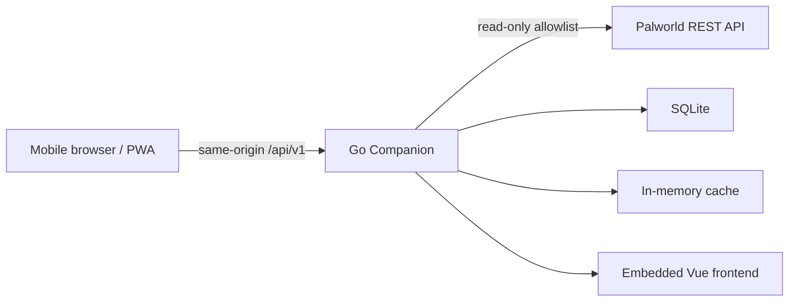

# Palworld Companion

[简体中文](README.md) | **English**

[](LICENSE)


Palworld Companion is a self-hosted, mobile-first PWA for Palworld players. Its Go backend reads the Palworld REST API through a strict read-only boundary, persists Companion-owned data, and embeds the Vue frontend in one executable.

**Stable deployment: v0.1.0. Current repository: v0.2.0 in development.**

## Current features

- Server dashboard with name, version, player count, FPS, uptime, world day, and base count.
- Online players with name, level, latency, and two-dimensional coordinates; private identifiers never enter public responses.
- Read-only Palworld REST API client for `/info`, `/metrics`, and `/players`.
- Short-lived in-memory caches, stale fallback, and sanitized upstream failure responses.
- Mobile-first layout, PWA shell, mock mode, and frontend assets embedded with Go.
- Single-binary systemd deployment without Docker.
- v0.2.0 development work: automatic SQLite initialization, versioned migrations, and persistent Tonight Tasks CRUD.

## Pages and modules

- **Home:** server status, key metrics, online players, pending task count, and the five most recent pending tasks.
- **Tonight Tasks:** create, edit, complete, reopen, delete, filter, and order tasks.
- **Settings:** instance and security-boundary information.
- `internal/palworld`: read-only Palworld adapter.
- `internal/serverstatus`: aggregation and caching.
- `internal/storage`: SQLite connection, PRAGMAs, and migrations.
- `internal/tasks`: task model, repository, and service.
- `internal/httpapi`: versioned APIs, security headers, and frontend hosting.

## Architecture



- Backend: Go, `net/http`, `database/sql`, `modernc.org/sqlite`, YAML, and `go:embed`
- Frontend: Vue 3, TypeScript, Vite, Pinia, Vue Router, and PWA
- Database: embedded SQLite with no CGo and no separate database service
- Deployment: one Linux AMD64 executable plus systemd

See [docs/architecture.md](docs/architecture.md) for more detail.

## Quick start

### Development requirements

- Go 1.24 or newer
- Node.js 24 or a compatible release
- npm

MySQL, PostgreSQL, a SQLite service, the `sqlite3` CLI, and Docker are not required.

### Run locally

```powershell
cd frontend
npm.cmd ci
npm.cmd run build
cd ..
go test ./...
go run ./cmd/companion --config deploy/config.example.yaml
```

Open <http://127.0.0.1:8091>. The example configuration enables mock mode and stores development data in `./data/companion.db`.

For frontend hot reload:

```powershell
# Terminal 1
go run ./cmd/companion --config deploy/config.example.yaml

# Terminal 2
cd frontend
npm.cmd run dev
```

Vite listens on <http://127.0.0.1:5173> by default and proxies `/api` to Companion.

## Configuration

```yaml
server:
  listen: "127.0.0.1:8091"
palworld:
  base_url: "http://127.0.0.1:8212"
  username: ""
  password: ""
  timeout: "3s"
database:
  path: "./data/companion.db"
app:
  mock_mode: true
```

| Key | Default | Purpose |
| --- | --- | --- |
| `server.listen` | `127.0.0.1:8091` | HTTP listen address |
| `palworld.base_url` | `http://127.0.0.1:8212` | Palworld REST API address |
| `palworld.timeout` | `3s` | Upstream timeout |
| `cache.info_ttl` | `30s` | Info cache lifetime |
| `cache.metrics_ttl` | `5s` | Metrics cache lifetime |
| `cache.players_ttl` | `3s` | Players cache lifetime |
| `database.path` | `/var/lib/palworld-companion/companion.db` | Production default used when an older config omits this key |
| `app.mock_mode` | `false` | Use local mock Palworld data |
| `logging.level` | `info` | Log level |

The parent database directory is created automatically. A database or migration error stops startup; Companion never silently falls back to in-memory storage and never deletes existing data.

## Build

```powershell
cd frontend
npm.cmd ci
npm.cmd run type-check
npm.cmd run lint
npm.cmd run build
cd ..
go test ./...
go build -o bin\palworld-companion.exe .\cmd\companion
```

Cross-compile a Linux AMD64 binary without CGo:

```powershell
$env:CGO_ENABLED = "0"
$env:GOOS = "linux"
$env:GOARCH = "amd64"
go build -o bin/palworld-companion-linux-amd64 ./cmd/companion
Remove-Item Env:CGO_ENABLED, Env:GOOS, Env:GOARCH
```

The Makefile also provides `frontend-build`, `test`, `build`, `run-mock`, and `build-linux`.

## Deployment

Recommended paths:

- Executable: `/usr/local/bin/palworld-companion`
- Configuration: `/etc/palworld-companion/config.yaml`
- Database: `/var/lib/palworld-companion/companion.db`
- Data directory: `/var/lib/palworld-companion`
- Unit: `/etc/systemd/system/palworld-companion.service`

Run the service as a dedicated unprivileged account and make only its data directory writable. The server needs the executable and YAML file, not Node.js or a database service. See [docs/deployment.md](docs/deployment.md).

## Backend API

Server status:

- `GET /api/v1/health`
- `GET /api/v1/system/version`
- `GET /api/v1/system/capabilities`
- `GET /api/v1/server/summary`
- `GET /api/v1/server/players`

Tasks:

- `GET /api/v1/tasks?status=all&limit=100`
- `POST /api/v1/tasks`
- `GET /api/v1/tasks/{id}`
- `PATCH /api/v1/tasks/{id}`
- `DELETE /api/v1/tasks/{id}`

Task status is restricted to `pending` and `completed`. Titles are limited to 200 characters, notes to 4,000 characters, and timestamps are stored in UTC and returned as ISO 8601.

## Security boundary

- The backend calls only the `/info`, `/metrics`, and `/players` Palworld allowlist and is not a transparent proxy.
- REST API credentials, player IPs, player IDs, user IDs, raw responses, and internal headers are never returned to the frontend.
- Companion does not read or modify Palworld saves and does not depend on the PST database.
- Real configuration, passwords, and runtime database files must not be committed.
- Public access should add HTTPS, authentication, and rate limiting. PWA Service Workers also require a secure context.

## Roadmap

- **v0.2.0:** SQLite, Tonight Tasks, crafting material calculator, and crafting plans.
- **Later:** breeding planner, live map, and custom markers.

The first v0.2.0 batch completes SQLite and Tonight Tasks. Item data, recursive recipes, inventory deductions, and crafting plans remain unfinished.

## License

Original source code is available under the [MIT License](LICENSE). Third-party data and assets retain their own licenses; see [NOTICE](NOTICE).

Palworld Companion is an unofficial community project. It is not affiliated with, authorized by, partnered with, or endorsed by Pocketpair, Inc. Palworld names, trademarks, and game content belong to their respective owners.
