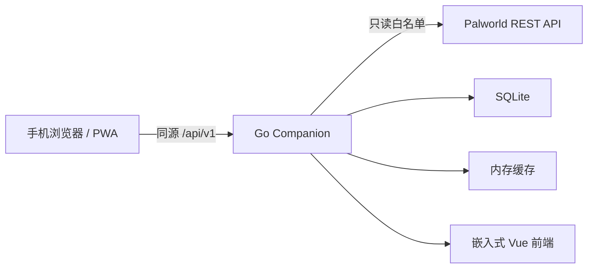

# Palworld Companion

**简体中文** | [English](README.en.md)

[](LICENSE)


Palworld Companion 是一个自托管、手机端优先的 Palworld 玩家辅助 PWA。Go 后端以只读方式连接 Palworld REST API、持久化 Companion 自身业务数据，并将 Vue 前端嵌入单个可执行文件。

**线上稳定版本：v0.1.0；当前仓库：v0.2.0 开发中。**

## 当前功能

- 服务器状态首页：名称、版本、人数、FPS、运行时间、世界天数与基地数量。
- 在线玩家：名称、等级、延迟与二维坐标，敏感标识不会进入公共响应。
- Palworld REST API `/info`、`/metrics`、`/players` 只读客户端。
- 短时内存缓存、stale fallback 和不泄露上游细节的故障响应。
- 移动端布局、PWA 应用外壳、Mock 模式和 Go 内嵌静态资源。
- systemd 单文件部署，不依赖 Docker。
- v0.2.0 开发内容：SQLite 自动初始化、版本化迁移和“今晚任务”持久化 CRUD。

## 页面与模块

- **首页**：服务器状态、核心指标、在线玩家、未完成任务数量和最近五条任务。
- **今晚任务**：新建、编辑、完成、恢复、删除、筛选和排序。
- **设置**：当前实例与安全边界说明。
- `internal/palworld`：Palworld 只读适配器。
- `internal/serverstatus`：状态聚合与缓存。
- `internal/storage`：SQLite 连接、PRAGMA 和迁移。
- `internal/tasks`：任务模型、repository 和 service。
- `internal/httpapi`：版本化 API、安全响应头和前端托管。

## 技术架构



- 后端：Go、`net/http`、`database/sql`、`modernc.org/sqlite`、YAML、`go:embed`
- 前端：Vue 3、TypeScript、Vite、Pinia、Vue Router、PWA
- 数据库：进程内 SQLite，无 CGo、无独立数据库服务
- 部署：Linux AMD64 单二进制 + systemd

详细设计见 [docs/architecture.md](docs/architecture.md)。

## 快速开始

### 开发环境要求

- Go 1.24 或更高版本
- Node.js 24 或兼容版本
- npm

不需要 MySQL、PostgreSQL、SQLite 服务、`sqlite3` 命令行或 Docker。

### 本地运行

```powershell
cd frontend
npm.cmd ci
npm.cmd run build
cd ..
go test ./...
go run ./cmd/companion --config deploy/config.example.yaml
```

访问 <http://127.0.0.1:8091>。示例配置启用 Mock 模式，并把开发数据库写入 `./data/companion.db`。

前端热更新：

```powershell
# 终端 1
go run ./cmd/companion --config deploy/config.example.yaml

# 终端 2
cd frontend
npm.cmd run dev
```

Vite 默认运行在 <http://127.0.0.1:5173>，并将 `/api` 代理到 Companion。

## 配置说明

```yaml
server:
  listen: "127.0.0.1:8091"
palworld:
  base_url: "http://127.0.0.1:8212"
  username: ""
  password: ""
  timeout: "3s"
database:
  path: "./data/companion.db"
app:
  mock_mode: true
```

| 配置 | 默认值 | 说明 |
| --- | --- | --- |
| `server.listen` | `127.0.0.1:8091` | HTTP 监听地址 |
| `palworld.base_url` | `http://127.0.0.1:8212` | Palworld REST API 地址 |
| `palworld.timeout` | `3s` | 上游超时 |
| `cache.info_ttl` | `30s` | info 缓存时间 |
| `cache.metrics_ttl` | `5s` | metrics 缓存时间 |
| `cache.players_ttl` | `3s` | players 缓存时间 |
| `database.path` | `/var/lib/palworld-companion/companion.db` | 旧配置缺失该项时使用的生产默认路径 |
| `app.mock_mode` | `false` | 是否使用本地 Mock Palworld 数据 |
| `logging.level` | `info` | 日志级别 |

数据库父目录会自动创建。数据库初始化或迁移失败时应用会停止启动，不会静默切换到内存存储，也不会删除已有数据。

## 构建方式

```powershell
cd frontend
npm.cmd ci
npm.cmd run type-check
npm.cmd run lint
npm.cmd run build
cd ..
go test ./...
go build -o bin\palworld-companion.exe .\cmd\companion
```

Linux AMD64 无 CGo 交叉构建：

```powershell
$env:CGO_ENABLED = "0"
$env:GOOS = "linux"
$env:GOARCH = "amd64"
go build -o bin/palworld-companion-linux-amd64 ./cmd/companion
Remove-Item Env:CGO_ENABLED, Env:GOOS, Env:GOARCH
```

Makefile 也提供 `frontend-build`、`test`、`build`、`run-mock` 和 `build-linux`。

## 部署说明

推荐路径：

- 程序：`/usr/local/bin/palworld-companion`
- 配置：`/etc/palworld-companion/config.yaml`
- 数据库：`/var/lib/palworld-companion/companion.db`
- 数据目录：`/var/lib/palworld-companion`
- unit：`/etc/systemd/system/palworld-companion.service`

使用独立低权限账户运行，并确保数据目录可写。服务器只需要单个二进制和 YAML 配置，不需要 Node.js 或数据库服务。完整说明见 [docs/deployment.md](docs/deployment.md)。

## 后端 API

状态接口：

- `GET /api/v1/health`
- `GET /api/v1/system/version`
- `GET /api/v1/system/capabilities`
- `GET /api/v1/server/summary`
- `GET /api/v1/server/players`

任务接口：

- `GET /api/v1/tasks?status=all&limit=100`
- `POST /api/v1/tasks`
- `GET /api/v1/tasks/{id}`
- `PATCH /api/v1/tasks/{id}`
- `DELETE /api/v1/tasks/{id}`

任务状态仅允许 `pending` 和 `completed`。标题最长 200 个字符，备注最长 4000 个字符；时间以 UTC 存储并输出 ISO 8601。

## 安全边界

- 后端只访问 Palworld 的 `/info`、`/metrics`、`/players` 白名单只读接口，不提供透明代理。
- 前端不会收到 REST API 凭据、玩家 IP、playerId、userId、原始响应或内部请求头。
- Companion 不读取或修改 Palworld 存档，也不依赖 PST 数据库。
- 真实密码、配置和运行数据库不得提交 Git。
- 公网开放前应使用 HTTPS、访问认证和速率限制；PWA Service Worker 也要求安全上下文。

## 开发路线图

- **v0.2.0**：SQLite、今晚任务、制作材料计算器、制作计划。
- **后续**：配种规划器、实时地图、自定义标记。

当前第一批已经完成 SQLite 与今晚任务；物品数据、配方递归、库存扣减和制作计划仍未实现。

## 许可证

原创源代码采用 [MIT License](LICENSE)。第三方数据和素材必须分别遵守其来源许可证，详见 [NOTICE](NOTICE)。

Palworld Companion 是非官方社区项目，与 Pocketpair, Inc. 无隶属、授权、合作或背书关系。Palworld、《幻兽帕鲁》名称、商标和游戏内容归各自权利人所有。
