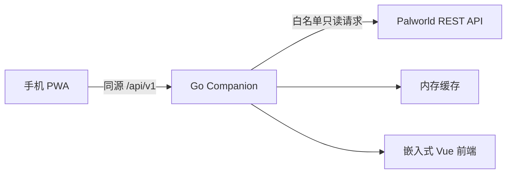

# Palworld Companion

> A self-hosted mobile-first PWA companion for Palworld servers.

Palworld Companion 是一个自托管、手机端优先的 Palworld 玩家辅助 PWA。每个 Palworld 服务器可部署一个 Companion 实例，由 Go 后端读取 Palworld 官方 REST API 的只读状态，并统一托管 Vue 前端。

当前版本：**v0.1.0**

## 当前功能

- 移动端优先的服务器状态首页。
- 服务器名称、版本、在线人数、FPS、运行时间、世界天数和基地数量。
- 在线玩家名称、等级、延迟和坐标；缺失字段显示“—”。
- 首次加载、手动刷新、前台 5 秒轮询和切回页面刷新。
- Companion 后端、Palworld API、缓存数据和离线状态的独立提示。
- `/info` 30 秒、`/metrics` 5 秒、`/players` 3 秒进程内缓存。
- 上游故障时返回上次成功数据并标记 `cached`、`stale`、`updatedAt`。
- PWA manifest、Service Worker 和静态应用外壳离线缓存；API 响应不进入 Service Worker 缓存。
- Mock Adapter 提供 Windows 本地开发数据，不连接真实 Palworld API。
- Vue 构建结果通过 `go:embed` 进入单个 Go 可执行文件。

> 截图占位：项目公开后可在此补充手机首页截图；仓库不包含 Palworld 官方图片或来源不明素材。

## 项目不是什么

本项目不是 Palworld 管理后台、存档修改器、PST 替代品、AI 聊天机器人或官方项目。v0.1.0 不提供 kick、ban、save、shutdown 等管理操作。

## 架构



详细设计见 [docs/architecture.md](docs/architecture.md)。

## 技术栈

- 后端：Go、`net/http`、`log/slog`、YAML、`go:embed`
- 前端：Vue 3、Vite、TypeScript、Pinia、Vue Router、PWA
- 持久化：SQLite 接口为后续版本预留，v0.1.0 不创建业务表
- 部署：单二进制、systemd、Ubuntu 24.04 x86_64，无 Docker

## 本地开发与模拟模式

要求：Go 1.24+、Node.js 24+、npm。

```powershell
cd D:\00-工作区\23-palworld\palworld-companion
cd frontend
npm.cmd install
npm.cmd run build
cd ..
go test ./...
go run ./cmd/companion --config deploy/config.example.yaml
```

访问 <http://127.0.0.1:8091>。示例配置默认 `mock_mode: true`，不会连接 `127.0.0.1:8212`。

前后端分离热更新：

```powershell
# 终端 1
go run ./cmd/companion --config deploy/config.example.yaml

# 终端 2
cd frontend
npm.cmd run dev
```

Vite 开发服务器为 <http://127.0.0.1:5173>，`/api` 代理到 Companion 的 8091 端口。

## 配置

复制 `deploy/config.example.yaml` 为不纳入 Git 的 `config.yaml`，再填写真实环境配置。命令行通过 `--config` 指定文件。

| 配置 | 默认/示例 | 说明 |
| --- | --- | --- |
| `server.listen` | `127.0.0.1:8091` | Companion 监听地址 |
| `palworld.base_url` | `http://127.0.0.1:8212` | Palworld REST API 根地址 |
| `palworld.timeout` | `3s` | 上游请求超时 |
| `cache.*_ttl` | `30s / 5s / 3s` | 三类只读数据缓存 |
| `app.mock_mode` | `true` | 使用 Mock Adapter，不连接 Palworld |
| `logging.level` | `info` | JSON 日志级别 |

真实用户名和密码不得提交。配置文件内容不会由任何前端路由返回。

## API

Companion 对外提供：

- `GET /api/v1/health`
- `GET /api/v1/system/version`
- `GET /api/v1/system/capabilities`
- `GET /api/v1/server/summary`
- `GET /api/v1/server/players`

后端只访问 Palworld 的 `GET /v1/api/info`、`GET /v1/api/metrics`、`GET /v1/api/players`。它不是透明代理，公共玩家结构不含 IP、playerId、userId 或认证数据。

## Windows 构建

```powershell
cd frontend
npm.cmd ci
npm.cmd run type-check
npm.cmd run lint
npm.cmd run build
cd ..
go test ./...
go build -ldflags "-X main.version=0.1.0" -o bin\palworld-companion.exe .\cmd\companion
```

Linux AMD64 交叉构建：

```powershell
$env:CGO_ENABLED = "0"
$env:GOOS = "linux"
$env:GOARCH = "amd64"
go build -ldflags "-X main.version=0.1.0" -o bin/palworld-companion-linux-amd64 ./cmd/companion
Remove-Item Env:CGO_ENABLED, Env:GOOS, Env:GOARCH
```

Makefile 提供 `frontend-install`、`frontend-build`、`test`、`build`、`run-mock` 和 `build-linux`。

## systemd 部署概览

示例位于 `deploy/palworld-companion.service`，使用独立低权限账户，`Restart=on-failure`，且不拥有 Palworld/PST 目录写权限。服务器不需要安装 Node.js。完整说明见 [docs/deployment.md](docs/deployment.md)。

## 安全说明

v0.1.0 默认建议仅监听 `127.0.0.1`。Palworld 官方 REST API 不应直接暴露到公网。公网使用前必须通过 HTTPS 反向代理并增加访问认证；后续版本将增加 Companion 自身认证。

Palworld REST API 凭据只存在后端。前端不直接请求 8212，Service Worker 不缓存 API 响应，公共 API 不返回玩家 IP、平台账号、原始错误堆栈或内部请求头。

## 路线图

- v0.1：状态首页
- v0.2：任务和制作计算器
- v0.3：配种规划
- v0.4：实时地图
- v1.0：标准稳定版

## 许可证与非官方声明

原创源代码采用 [MIT License](LICENSE)。第三方数据和素材必须分别遵循其来源许可证，详见 [NOTICE](NOTICE)。

Palworld Companion 是非官方社区项目，与 Pocketpair, Inc. 无隶属、授权、合作或背书关系。Palworld、《幻兽帕鲁》名称、商标、游戏内容及相关素材归各自权利人所有。