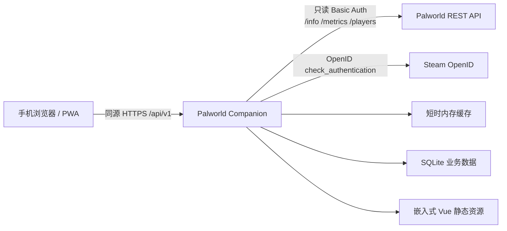

# 架构

Palworld Companion 是单体、自托管应用。前端构建产物嵌入 Go 二进制，浏览器不会接触 Palworld REST API 凭据。v0.2.0 开发分支增加独立 SQLite 业务存储。

## 后端模块

- `internal/config`：YAML 配置、默认值和持续时间校验。
- `internal/palworld`：只读客户端接口、HTTP Adapter 和 Mock Adapter。
- `internal/serverstatus`：状态聚合、字段规范化、缓存及 stale fallback。
- `internal/auth`：Steam OpenID 流程、首次在线角色绑定、用户、哈希 Session、管理员状态与 CLI repository。
- `internal/storage`：纯 Go SQLite 连接、PRAGMA、连接池和版本化迁移。
- `internal/tasks`：今晚任务模型、repository、输入校验和状态转换。
- `internal/httpapi`：`/api/v1`、安全响应头、SPA 托管。
- `internal/app`：依赖装配，避免业务代码散布 mock 分支。
- `web`：通过 `go:embed` 嵌入 `web/dist`。

## 数据与安全边界

客户端只实现 `GET /v1/api/info`、`GET /v1/api/metrics`、`GET /v1/api/players`。玩家 IP、playerId、userId 和 Palworld 凭据不会进入 Companion 公共响应。上游错误对外统一为不含内部地址和认证信息的错误文字。

SQLite 默认位于 `/var/lib/palworld-companion/companion.db`，使用 WAL、外键约束和 5 秒 busy timeout。迁移版本 2 创建 `users`、`sessions`、`auth_flows`，版本 3 为 `tasks` 增加 `owner_id`、`created_by` 和 `visibility`。从版本 1 升级时，既有任务会迁移为无归属共享任务且仅管理员可修改。程序会拒绝高于自身支持版本的数据库。

公开玩家 DTO 只包含 `name`、`level`、`ping`、`position`。身份绑定直接调用 Palworld client 获取新鲜 `/players`，不经过 serverstatus 缓存或 stale fallback；内部 `userId`、`playerId`、`accountName` 不进入公开响应。首次注册必须精确匹配 `steam_<SteamID64>`，已有用户登录不依赖上游可用性。

Session 原始随机 Token 只写入 Secure、HttpOnly、SameSite=Lax Cookie，SQLite 仅保存 SHA-256。OpenID state 同样只保存哈希，10 分钟过期并单次消费。任务查询在 SQL 层按当前用户和可见性过滤，管理员接口在后端重复验证 active admin 身份。
