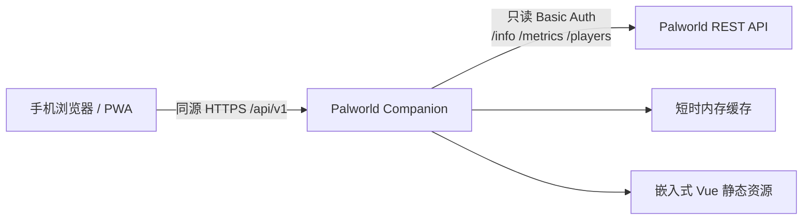

# 架构

Palworld Companion v0.1.0 是单体、自托管应用。前端构建产物嵌入 Go 二进制，浏览器不会接触 Palworld REST API 凭据。

## 后端模块

- `internal/config`：YAML 配置、默认值和持续时间校验。
- `internal/palworld`：只读客户端接口、HTTP Adapter 和 Mock Adapter。
- `internal/serverstatus`：状态聚合、字段规范化、缓存及 stale fallback。
- `internal/httpapi`：`/api/v1`、安全响应头、SPA 托管。
- `internal/app`：依赖装配，避免业务代码散布 mock 分支。
- `web`：通过 `go:embed` 嵌入 `web/dist`。

## 数据与安全边界

客户端只实现 `GET /v1/api/info`、`GET /v1/api/metrics`、`GET /v1/api/players`。玩家 IP、playerId、userId 和 Palworld 凭据不会进入 Companion 公共响应。上游错误对外统一为不含内部地址和认证信息的错误文字。

v0.1.0 不创建 SQLite 业务表；后续业务数据将使用独立数据库，不依赖 PST 或 Palworld 存档。