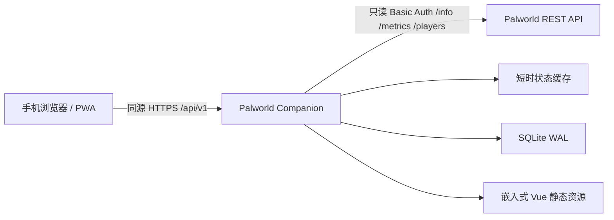

# 架构

Palworld Companion 0.3.0-dev 是单体、自托管应用。Vue PWA 嵌入纯 Go 二进制；账号、Session 和任务属于 Companion 自身 SQLite，浏览器不会接触 Palworld REST API 凭据。

认证流程没有外部 Steam 节点。SteamID64 是玩家提交的身份标识，只在注册时与实时 `/players` 的 `steam_<SteamID64>` 严格匹配。

## 后端模块

- `internal/config`：YAML、兼容字段、默认值和持续时间校验。
- `internal/palworld`：只读客户端与绕过状态缓存的身份绑定读取。
- `internal/serverstatus`：公共状态聚合、短时缓存和 stale fallback。
- `internal/auth`：Argon2id、本地登录、首任初始化、玩家申请、审批状态、Session 和管理员保护。
- `internal/storage`：纯 Go SQLite、WAL、外键、busy timeout 和版本化事务迁移。
- `internal/tasks`：个人/共享任务和对象级权限。
- `internal/httpapi`：API、受控错误、进程内限速、安全响应头和 SPA。
- `cmd/companion`：服务入口及只从 TTY 读取密码的恢复 CLI。

## schema 4

迁移 4 安全重建 `users`，保留原有主键，并增加：

- 可空且大小写不敏感唯一的 `username`
- 可空 `password_hash`，兼容没有本地密码的旧用户
- `pending/active/disabled/rejected/deleted` 状态
- `approved_at/by`、`rejected_at/by`、`rejection_reason`
- 删除前状态，用于软删除后的正确恢复
- `system_settings.setup_completed`

迁移复制 schema 3 用户后恢复并检查外键，因此 Session、任务 `owner_id/created_by` 和可见性保持不变。旧库有管理员时 `setup_completed=true`，否则为 false。初始化完成后不再根据管理员数量重新计算。

## 认证与 Session

初始化管理员、设置完成标志和首个 Session 在同一数据库事务中创建。用户名使用 SQLite `COLLATE NOCASE` 唯一索引；SteamID64 必须为非零 uint64 十进制字符串。

密码采用 Argon2id PHC 编码，验证使用恒定时间比较并限制编码参数，防止异常哈希触发不受控资源消耗。Session 使用 256 位随机 Token；客户端 Cookie 为 Secure、HttpOnly、SameSite=Lax、Path=/，数据库只保存 SHA-256。

注册身份读取直接调用 Palworld client，不经过 `serverstatus` 缓存。注册失败时不会回退过期结果；已有 active 用户的密码登录不访问 Palworld。

## 权限与隐私

公开玩家 DTO 只包含 `name`、`level`、`ping`、`position`。SteamID64、Palworld userId/playerId、accountName 仅出现在当前账号或管理员接口，不进入公共玩家响应。

任务查询在 SQL 层按 actor 和 visibility 过滤，并由 service 重复校验管理权限。玩家无法读取其他人的个人任务；共享任务只有创建者或管理员能写；无权对象统一返回 404。

管理员写接口重新验证当前 active Session 与 admin 角色。当前管理员不能禁用或删除自己；最后一个 active 管理员不能被禁用、删除或降级。禁用、删除和密码重置都会撤销目标 Session。

Service Worker 的 navigation fallback 拒绝整个 `/api/`，没有认证、初始化、注册、任务或管理员响应进入缓存。
